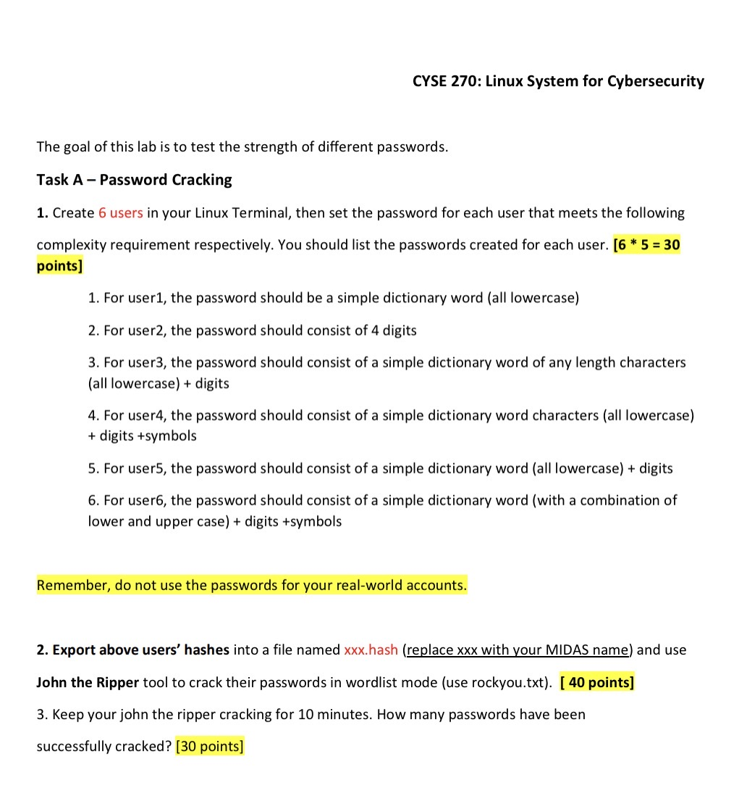
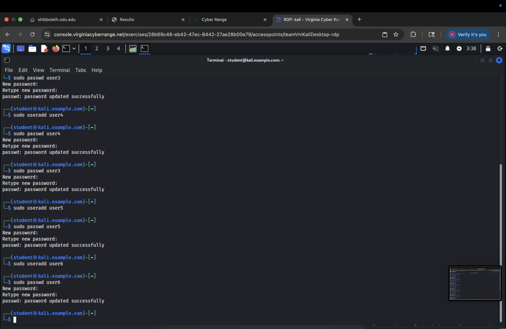

# Linux-Password-Security-Cracking-Lab
Conducted a Linux cybersecurity lab creating user accounts, assigning varied password complexities, exporting hashes, and using John the Ripper to test password strength.
<h2>Languages and Utilities Used</h2>

- <b> Bash Shell </b> 

<h2>Environments Used </h2>

- <b>Kali Linux VM </b>

<h2>Program walk-through:</h2>

<p align="center">
Tasks assigned for the lab:  <br/>

<br />
<br />

<br />
<br />
<br/>

<br />
<br />

<br />
<br />


<!--
 ```diff
- text in red
+ text in green
! text in orange
# text in gray
@@ text in purple (and bold)@@
```
--!>
